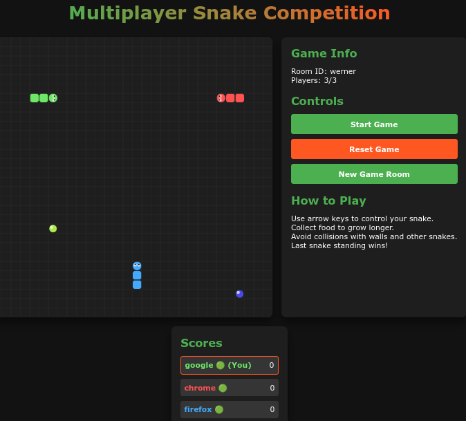
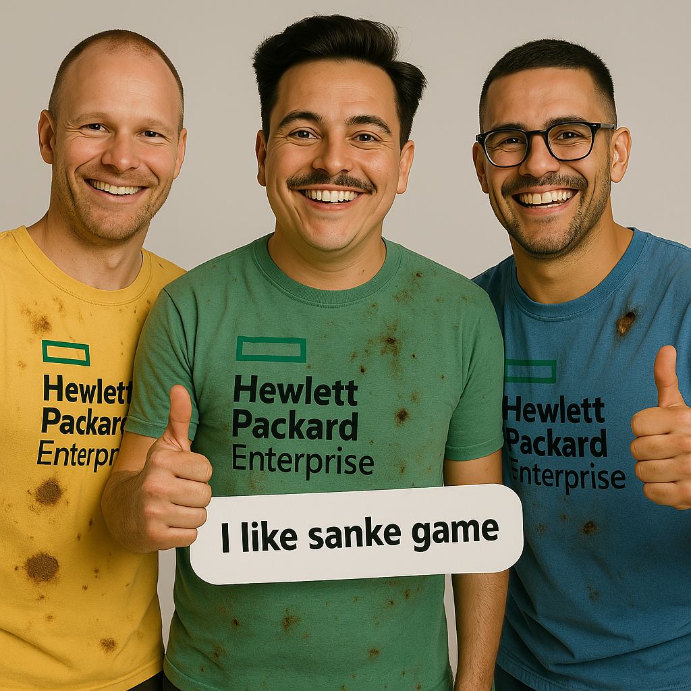

# 🐍 Multiplayer Snake Competition

<p align="center">
  
</p>

<p align="center">
  <a href="https://nodejs.org/en/"></a>
  <a href="https://socket.io/"></a>
  <a href="https://expressjs.com/"></a>
  <a href="#"></a>
</p>

A real-time multiplayer Snake game where players can compete against each other in custom game rooms. Features include responsive design, mobile support, and real-time gameplay using WebSockets.

## 🚀 [Play the Game](https://amarmax.duckdns.org:10556)

## ✨ Features

- **Multiplayer Support**: Up to 3 players per game room
- **Room System**: Create or join specific game rooms
- **Grace Period**: 3-second countdown at game start to prevent early collisions
- **Real-time Updates**: Synchronized game state across all clients
- **Responsive Design**: Mobile-friendly with touch controls
- **Visual Feedback**: Game over screens, winner announcements, and score tracking
- **Reconnection Support**: Automatically reconnect to your game if disconnected

## 🛠️ Technologies

- **Frontend**: HTML5, CSS3, JavaScript, Canvas API
- **Backend**: Node.js, Express
- **Real-time Communication**: Socket.IO
- **Deployment**: PM2 Process Manager, HTTPS

## 📋 Prerequisites

- Node.js (v14+)
- npm or yarn
- SSL certificates (for production deployment)

## 📸 Screenshots & Demo

<p align="center">
  
</p>

## 🔧 Installation

1. Clone the repository:
   ```bash
   git clone https://github.com/yourusername/multiplayer-snake.git
   cd multiplayer-snake
   ```

2. Install dependencies:
   ```bash
   npm install
   ```

3. Configure your SSL certificates (for production):
   - Place your SSL certificates in the `certificates` folder
   - Update paths in server.js if necessary

4. Start the development server:
   ```bash
   node server.js
   ```

## 🚀 Deployment with PM2

For production deployment, we recommend using PM2 to manage the Node.js process.

### Basic Commands
```bash
# Start your application
pm2 start server.js --name snake-game

# Restart your application
pm2 restart snake-game

# Stop your application
pm2 stop snake-game

# Delete/remove application from PM2
pm2 delete snake-game

# List all running applications
pm2 list

# Display detailed information about a specific application
pm2 show snake-game
```

### Monitoring & Logs
```bash
# Monitor all applications in real-time
pm2 monit

# Display logs of all applications
pm2 logs

# Display only snake-game logs
pm2 logs snake-game

# Display limited number of lines
pm2 logs snake-game --lines 100

# Flush all log data
pm2 flush
```

### Startup & Auto-Restart
```bash
# Generate startup script to automatically start PM2 on system boot
pm2 startup

# Save current PM2 process list for automatic restart
pm2 save

# Restore previously saved processes
pm2 resurrect
```

## 🎮 How to Play

1. Enter your name and game room ID (or use the default)
2. Wait for other players to join or start the game
3. Control your snake with arrow keys (desktop) or touch controls (mobile)
4. Collect food to grow your snake and score points
5. Avoid collisions with walls and other snakes
6. Last snake standing wins!

## 👨‍💻 The Team

We're the enthusiastic developers behind this multiplayer Snake game!

<p align="center">
  
</p>

Our team consists of:
- **Max Steinbauer** - Frontend Development & UI Design
- **Amar Novalic** - Backend & Socket.IO Implementation
- **Max Gradischnig** - Game Logic & Server Architecture

## 📝 License

This project is licensed under the MIT License - see the [LICENSE](LICENSE) file for details.

## 🙏 Acknowledgements

- Socket.IO team for their excellent real-time communication library
- The classic Snake game for inspiration
- Our friends and family who tested countless early versions
